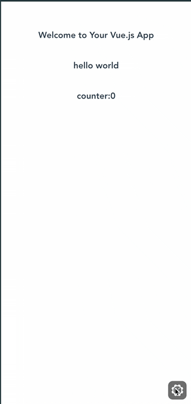
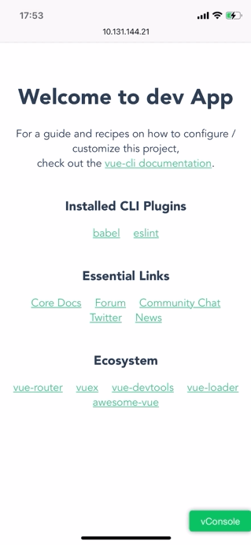

**# Vue-devtools-plugin**

`Vue-devtools-plugin` 是一款`vConsole` & `Eruda` 插件，把`Vue.js`官方调试工具`vue-devtools`移植到移动端，可以直接在移动端查看调试`Vue.js`应用

### Preview
[CodePen Sample Code for Vue2](https://codepen.io/zippowxk/pen/RwVBgmp)

[CodePen Sample Code for Vue3](https://codepen.io/zippowxk/pen/QWgpJbX)

桌面使用：



移动端使用：


### 为什么需要本插件：

1. 在任意浏览器和移动端上查看调试`Vue.js`应用
2. 无需在浏览器安装`Vue-devtools`插件
3. 支持Vue2 & Vue3

### 功能

1. 移植了官方Vue-devtools的全部功能
2. 针对移动端优化了部分操作方式
3. 现已支持微信端内浏览器

### 使用方式
#### NPM方式引入
1. vConsole: ```yarn add vue-vconsole-devtools --dev```
   Eruda: ```yarn add eruda-vue-devtools --dev```
2. 在工程中入口文件 （如`src/main.js`）

```javascript
...
// vconsole
import VConsole from "vconsole";
import { initPlugin } from 'vue-vconsole-devtools' // for vconsole

initPlugin(new VConsole()); // 需要在创建Vue根实例前调用
...
```

```javascript
...
// eruda
import { initPlugin } from 'eruda-vue-devtools' // for eruda
import eruda from 'eruda' // 引入工具包

eruda.init() // 初始化
initPlugin(eruda); // 需要在创建Vue根实例前调用
...
```

3. 如果devtools中没有加载出你的应用 请添加如下代码

```javascript
// Vue 2.x
Vue.config.devtools = true;
window.__VUE_DEVTOOLS_GLOBAL_HOOK__.emit("init",Vue)
```

#### CDN方式引入

```html
<script src="https://unpkg.com/vconsole/dist/vconsole.min.js"></script>
<script src="https://cdn.jsdelivr.net/npm/vue-vconsole-devtools@1.0.5/dist/vue_plugin.js"></script>
<script>
  var vConsole = new window.VConsole();
  const Devtools = window.vueVconsoleDevtools
  Devtools.initPlugin(vConsole);
</script>
```
### 高级用法

1. 只在开发环境下引入

   ```javascript
   new Vue({
     render: (h) => h(App),
   }).$mount("#app");
   
   // 在创建跟实例以后调用， 需要借助webpack的异步模块加载能力
   if(process.env.NODE_ENV === "development"){
      Promise.all([import("vconsole"), import("vue-vconsole-devtools")]).then(
        (res) => {
          if (res.length === 2) {
            Vue.config.devtools = true;
            window.__VUE_DEVTOOLS_GLOBAL_HOOK__.emit("init",Vue)
            const VConsole = res[0].default;
            const Devtools = res[1].default;
            Devtools.initPlugin(new VConsole());
          }
        }
      );
    }
   ```
### 更新日志

#### 1.0.9
1. 兼容了vConsole 3.14之后的新版本
2. 更新Vue-devtools 6.5.0 支持更新的功能
3. 更新之后解决了遗留的一些问题

#### v1.0.5
1. 兼容CDN引入，优化引入方式
2. 兼容ES6 解构运算符引入方式

#### v1.0.0
1. 重大更新，升级Vue-devtools V6
2. 兼容Vue3

#### v0.0.7
1. 重要更新，解决iOS微信端浏览器兼容性问题
2. 解决iOS阿里mPass容器兼容性问题
   
#### v0.0.3
1. 优化了打包体积

**### Sample code**

[Github](https://github.com/Zippowxk/Vue-vConsole-devtools/dev)


欢迎添加微信 **OmniBug **探讨交流，Email: zippowangxinkai@gmail.com
